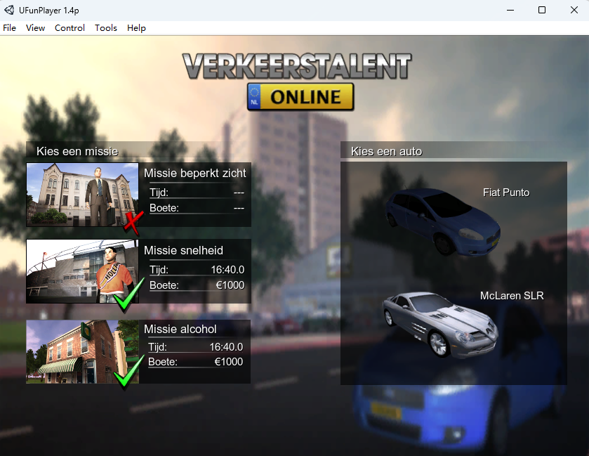
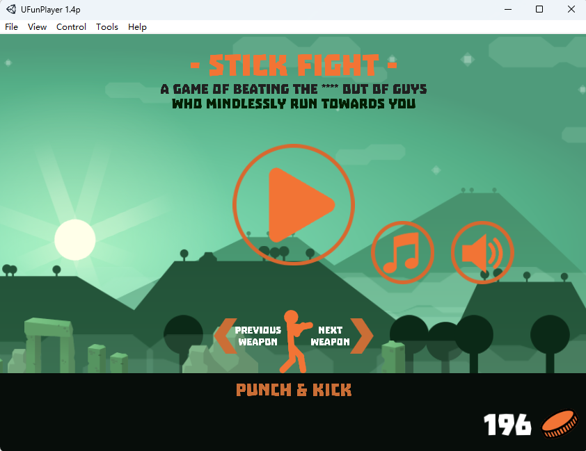

<p align="center">
  
</p>

<h1 align="center">UFunPlayer</h1>

<p align="center"><em>"They had no player — so we made it ours."</em></p>

<p align="center">
  <a href="https://github.com/mtdcmz/UFunPlayer/stargazers"></a>
  <a href="https://github.com/mtdcmz/UFunPlayer/network/members"></a>
  <a href="https://github.com/mtdcmz/UFunPlayer/issues"></a>
  <a href="https://github.com/mtdcmz/UFunPlayer/releases/latest"></a>
  <a href="https://github.com/mtdcmz/UFunPlayer/releases/latest"></a>
  
  
  
</p>

Standalone Unity Web Player for Windows. Drag, drop, play – no browser needed.

> **Homage:** This project is a spiritual successor to
> [UniPlayer](https://web.archive.org/web/20200701174743/http://www.nibiirosoft.com/Product/UniPlayer_en.html)
> by [nibiirosoft](https://github.com/nibiirosoft) (nibiironokane), whose
> slogan was *"If they have no player, let them make it."* The first version
> of UFunPlayer was written by studying a decompiled UniPlayer; it has since
> grown far beyond its inspiration.

## Usage

1. Place `UFunPlayer.exe` next to a `Runtime` folder (see Releases).
2. Launch the program.
3. Drag a `.unity3d` file onto the window, or use **File → Open**.
4. Press **F11** to toggle full‑screen.

The correct Unity runtime is selected automatically based on the bundle version.

## Experimental Features

**Control → Experimental Features → Frame Rate Override**

Classic Unity Web Player games are frame‑limited — most are locked at 30 or
60 fps by their own `targetFrameRate` / V‑Sync settings. This feature lifts
the cap and lets you run games at any frame rate you choose (for example,
30 fps games at a full 60):

- Enter a target FPS and click **Apply** (0 disables the override, max 1000).
- Works by neutralizing all three throttle layers — the loader's pump rate,
  the engine's internal frame wait, and the GPU‑side present interval — for
  both the D3D9 and D3D11 render paths, across all bundled runtime versions.
- Changes usually apply immediately; if a game keeps its old frame rate,
  reload the game.
- V‑Sync stays disabled while the override is active, so mild screen tearing
  may occur; targets above your monitor's refresh rate are capped by it.

## Tools Integration

UFunPlayer can launch external tools (e.g., decompilers, asset extractors, or custom utilities) directly from its **Tools** menu.

- Place any `.exe` files you want to use inside a `Tools` folder next to `UFunPlayer.exe`.
- By default the Tools menu is hidden. To enable it, go to **Tools → Enable Tools** and confirm the warning dialog.
- Once enabled, the menu will show a **Refresh** button and list all `.exe` files found in the `Tools` folder.
- Click any tool name to launch it. The tool's working directory is set to the folder containing the `.exe`.
- Tools are loaded on startup if previously enabled; you can refresh the list at any time.

> **Note:** Enabling the Tools feature allows arbitrary executables to be run. Only place trusted tools in the `Tools` folder.

## Language Packs

Interface translations are supported via `.lang` files placed in a `langs` folder next to the executable. They are selected under **Control → Language**.

## Save Data (PlayerPrefs) Warning

Unity Web Player saves game data (PlayerPrefs) by encoding the **full path** of
the `.unity3d` file into the save file name.

If that path is very long, or contains many non‑ASCII characters (e.g. Chinese),
the resulting save path can exceed Windows' 260‑character `MAX_PATH` limit.
When that happens, **saves are silently lost** — the file is simply never written.

### How to keep saves working
- Move the `.unity3d` file to a short, **all‑English** folder, for example:
  `C:\Games\game.unity3d`
- Keep both the folder names and the file name as short as possible.
- Avoid deep nested directories.

UFunPlayer will warn you on open if it detects that the save path is too long.

## Clearing User Data

The **Help → Clear User Data** menu item resets your recent‑file history and disables the Tools feature (you will need to re‑enable it via the menu). This is useful for privacy or troubleshooting.

## Referer Spoofing

Some game CDNs reject `.unity3d` downloads unless the request carries a valid `Referer` from the host site. UFunPlayer can inject that header so blocked games still load.

Enter both the game URL and the referer URL in **File → Open**, then click **OK**. The request is sent with the spoofed referer and the bundle loads directly. Applies to remote URLs only.

## Browser Integration (unitywp: Protocol)

UFunPlayer registers the `unitywp:` protocol on startup so Chromium‑based browsers can launch it directly from a game page.

**URL format:**

```
unitywp:<gameURL>|<refererURL>
```

The `|` separator (URL‑encoded as `%7C` by browsers) is decoded by UFunPlayer. The referer part is optional.

A companion browser extension automates this on supported game pages. Source code: [mtdcmz/UFPLoader](https://github.com/mtdcmz/UFPLoader/).

## License

Licensed under the GNU General Public License v3.0.
The full license text is in the [LICENSE](LICENSE) file.

## Extra 

 



This repo forked from [mtdcmz/UFunPlayer](https://github.com/mtdcmz/UFunPlayer). 

### Bug fixed
- unity 5+ will load from mono\5.xx && player\5.xx, and other versions will load from mono\3.xx && player\3.xx
- fix 'Warning: Save data (PlayerPrefs) will NOT work!', make hash for Chinese folder path or long path of .unity3d file

### Offline Web Player installers

[Offline Web Player installers download](https://discussions.unity.com/t/offline-web-player-installers/605216)

With the recent announcement to deprecate the web player we’ve also decided to no longer couple the offline web player with the simulation license it was made for initially.

The installers are available freely at the following links:

- 5.3.x: http://files.unity3d.com/stefan/webplayer/webplayer_archive/ClosedNetworkPlayer_5.3.1f1.zip + http://files.unity3d.com/stefan/webplayer/webplayer_archive/ClosedNetworkPlayer_5.3.2f1.zip + http://files.unity3d.com/stefan/webplayer/webplayer_archive/ClosedNetworkPlayer_5.3.3f1.zip + http://files.unity3d.com/stefan/webplayer/webplayer_archive/ClosedNetworkPlayer_5.3.4f1.zip +

http://files.unity3d.com/stefan/webplayer/webplayer_archive/ClosedNetworkPlayer_5.3.5f1.zip+ http://files.unity3d.com/stefan/webplayer/webplayer_archive/ClosedNetworkPlayer_5.3.6f1.zip +
http://files.unity3d.com/stefan/webplayer/webplayer_archive/ClosedNetworkPlayer_5.3.7f1.zip + http://files.unity3d.com/stefan/webplayer/webplayer_archive/ClosedNetworkPlayer_5.3.8f1.zip + http://files.unity3d.com/stefan/webplayer/webplayer_archive/ClosedNetworkPlayer_5.3.8f2.zip

- 5.2.x: http://files.unity3d.com/stefan/webplayer/webplayer_archive/ClosedNetworkPlayer_5.2.4f1.zip

- 5.0 to 5.1.4: http://files.unity3d.com/stefan/webplayer/webplayer_archive/ClosedNetworkPlayer_5.1.4f1.zip

- 3.x to 4.7.2: http://files.unity3d.com/stefan/webplayer/webplayer_archive/ClosedNetworkPlayer_4.7.0f1.zip + http://files.unity3d.com/stefan/webplayer/webplayer_archive/ClosedNetworkPlayer_4.7.1f1.zip +

http://files.unity3d.com/stefan/webplayer/webplayer_archive/ClosedNetworkPlayer_4.7.2f1.zip

The zip archives contain the following installers:

UnityWebPlayerFull.exe: Normal player which runs in Windows Firefox and IE (both 32bit).
UnityWebPlayerDevelopment.exe: Development player which runs in Windows Firefox and IE (both 32bit).
webplayer-x86_64.dmg: Normal player which runs on OSX Firefox and Safari.
These players come with a runtime packaged and don’t need an internet connection to start or run content. They are however limited to this one runtime which has some compatibility implications as listed above.

For example if you have the 4.6.9 player installed you can only run 3.x-4.6.9 content with it. It will not play anything made with 5.0.x or 5.1.x or 5.2.x.

Hope they are of use to you.
